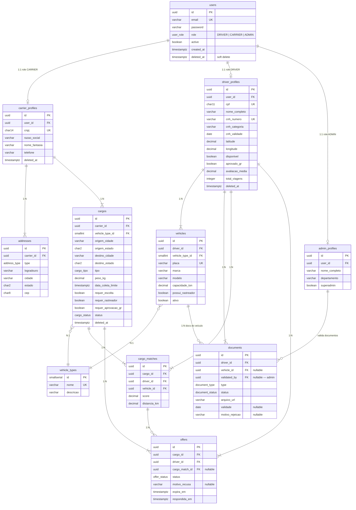

# Diagrama Entidade-Relacionamento — VAPT VUPT

> Mermaid — renderiza nativamente no GitHub.

## Diagrama ER Completo

---

## ENUMs

| ENUM | Valores |
|------|---------|
| `user_role` | `DRIVER`, `CARRIER`, `ADMIN` |
| `address_type` | `SEDE`, `FILIAL`, `OPERACIONAL` |
| `document_type` | `CNH`, `CRLV`, `IPVA`, `LICENCIAMENTO`, `FOTO_VEICULO`, `CNPJ`, `COMPROVANTE_RESIDENCIA`, `ANTECEDENTES_CRIMINAIS` |
| `document_status` | `PENDENTE`, `APROVADO`, `REJEITADO`, `EXPIRADO` |
| `cargo_tipo` | `CARGA_GERAL`, `CARGA_FRIGORIFICADA`, `CARGA_PERIGOSA`, `CARGA_VIVA`, `GRANEL_SOLIDO`, `GRANEL_LIQUIDO`, `CARGA_INDIVISIVEL`, `VEICULOS` |
| `cargo_status` | `AGUARDANDO`, `MATCHING`, `OFERTA_ENVIADA`, `MOTORISTA_ALOCADO`, `EM_TRANSITO`, `CONCLUIDO`, `CANCELADO` |
| `offer_status` | `ENVIADA`, `ACEITA`, `RECUSADA`, `EXPIRADA`, `CANCELADA` |

---

## Estratégia de perfis (3 roles)

A tabela `users` centraliza autenticação. Cada role possui sua própria tabela de perfil com relacionamento 1:1, o que satisfaz a 3FN — os atributos de cada perfil dependem apenas da própria chave, não de atributos de `users`.

| Role | Tabela de perfil | Atributos exclusivos |
|------|-----------------|----------------------|
| `CARRIER` | `carrier_profiles` | CNPJ, razão social, nome fantasia |
| `DRIVER` | `driver_profiles` | CPF, CNH, geolocalização, disponibilidade, aprovação GR |
| `ADMIN` | `admin_profiles` | departamento, flag superadmin |

O admin interage com o sistema através de `admin_profiles.validated_by` em `documents`, permitindo rastrear qual administrador aprovou ou rejeitou cada documento.

---

## Justificativa de normalização (3FN)

| Decisão | Justificativa |
|---------|---------------|
| Tabelas de perfil separadas de `users` | Atributos de cada perfil dependem da chave do perfil, não de `users` — elimina dependência transitiva |
| `addresses` separado de `carrier_profiles` | CEP, cidade e UF são fatos do endereço, não da empresa |
| `vehicle_types` separado de `vehicles` | Descrição do tipo depende do `id` do tipo, não da placa — elimina dependência transitiva |
| `documents` separado de `driver_profiles` | Um motorista tem múltiplos documentos com ciclos de vida independentes |
| `cargo_matches` separado de `offers` | Score do algoritmo e resposta do motorista são fatos distintos |
| ENUMs no banco | Integridade de domínio sem tabela auxiliar para valores estáveis |